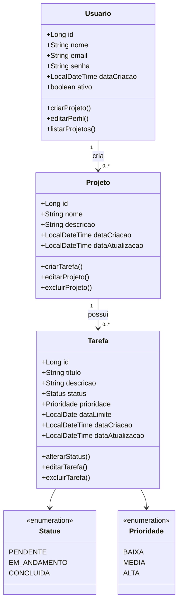

# Diagrama de Classes - Gestor de Tarefas

## Descrição

O diagrama de classes representa a estrutura estática do sistema Gestor de Tarefas, evidenciando as principais entidades do domínio, seus atributos, métodos e relacionamentos.

---

## Relacionamentos

- Um **Usuário** pode criar vários **Projetos**.
- Um **Projeto** possui várias **Tarefas**.
- Cada **Tarefa** possui um **Status**.
- Cada **Tarefa** possui uma **Prioridade**.

## Classes

### Usuario

Representa o usuário autenticado no sistema.

### Projeto

Agrupa tarefas relacionadas a um objetivo específico.

### Tarefa

Representa uma atividade que deve ser realizada dentro de um projeto.

### Status

Enumeração responsável por controlar o estado da tarefa.

### Prioridade

Enumeração responsável por definir o nível de importância da tarefa.